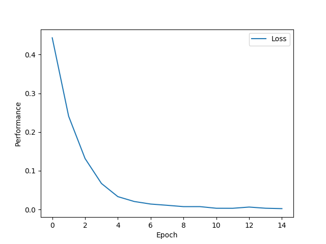

# Weekly Homework 7

#### Dalton Rothenberger

## 1: Learning Rate

**SimpleRNN**

Out of all the recurrent units I tried, SimpleRNN performed the worst. It performed similar to or even worse than the Bag of Words approach from Part 1. This graph highlights that the learning of this model was not stable at all. It was spiking up and down until the last few epochs where it started to continuously go down. This model did not learn quickly and its learning was not consistent. It would learn something but then on the next epoch it would perform worse.

**GRU**

GRU was the recurrent unit that performed the best. As the graph shows it learned in a very stable and did not spike up or down at all. This model learned the quickest. By epoch 4 the model had already accomplished the majority of its learning. The difference between epoch 4 and epoch 14 is small in comparison to the difference between epoch 4 and 14 in SimpleRNN’s graph.

**LSTM**

LSTM also performed well but it wasn’t not able to beat out GRU. The graph shows that its learning was stable but still had some spikes such as around epoch 10. This model had most of its learning done by epoch 6. The difference between epoch 4 and 14 in this graph was a little bit more than the difference in the GRU graph which again highlights it learning slower than GRU.

## 2: Accuracy

### Baseline

##### Max Features = 500, Max Length = 50

|                                    | Accuracy | Score  |
| ---------------------------------- | -------- | ------ |
| **Bag of Words (Batch size = 32)** | 0.6819   | 2.2266 |

### Recurrent Models

##### Max Features = 500, Max Length = 50

|                                                | Accuracy | Score  |
| ---------------------------------------------- | -------- | ------ |
| **GRU (Batch size = 32)**                      | 0.7545   | 0.7570 |
| **GRU (Batch size = 32, Dropout = 0.2)**       | 0.7594   | 0.6843 |
| **LSTM (Batch size = 32)**                     | 0.7596   | 0.6081 |
| **LSTM (Batch size = 32, Dropout = 0.2)**      | 0.7592   | 0.5905 |
| **SimpleRNN (Batch size = 32)**                | 0.6862   | 0.5875 |
| **SimpleRNN (Batch size = 32, Dropout = 0.2)** | 0.6546   | 0.6095 |

##### Max Features = 20,000, Max Length = 80

|                                                | Accuracy | Score  |
| ---------------------------------------------- | -------- | ------ |
| **GRU (Batch size = 32)**                      | 0.8071   | 1.5070 |
| **GRU (Batch size = 32, Dropout = 0.2)**       | 0.8142   | 1.2643 |
| **LSTM (Batch size = 32)**                     | 0.8115   | 1.0614 |
| **LSTM (Batch size = 32, Dropout = 0.2)**      | 0.8059   | 1.0915 |
| **SimpleRNN (Batch size = 32)**                | 0.734    | 0.6682 |
| **SimpleRNN (Batch size = 32, Dropout = 0.2)** | 0.6522   | 0.6218 |

The Bag of Words method had a surprisingly high accuracy of 68%, I expected its accuracy to be much closer to 50%. Both LSTM and GRU consistently performed better than the Bag Of Words method but SimpleRNN was closer to the Bag Of Words method in terms of accuracy. LSTM performed better than GRU in the first setup but GRU performed the better in the second setup. Increasing the Max Features and Max Length resulted in an increase in accuracy of roughly 5% for all the recurrent models. One interesting pattern was that adding dropout increased the accuracy for GRU but for LSTM and SimpleRNN it actually caused a decrease in accuracy.